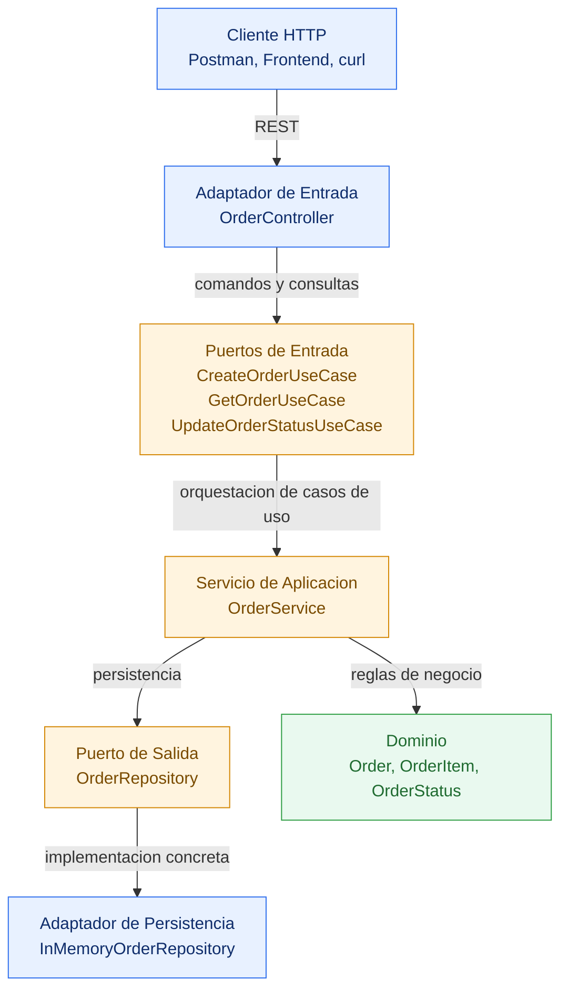

# algoritmos-castellanos-post1-u8

Post-Contenido 1 - Unidad 8 (Diseno de Sistemas)
Materia: Analisis y Diseno de Algoritmos
Universidad de Santander (UDES)

## Objetivo

Implementar una API REST de gestion de pedidos con arquitectura hexagonal en Java 17,
separando:

- Dominio (modelo y reglas de negocio)
- Aplicacion (casos de uso)
- Adaptadores (HTTP y persistencia)

## Arquitectura Hexagonal

Diagrama de componentes (dinamico, renderizado por GitHub con Mermaid):



Version ASCII:

```text
+-------------------------------+
| Cliente HTTP / Frontend       |
+---------------+---------------+
				|
				v
+---------------+---------------+
| Adaptador in (HTTP)           |
| OrderController               |
+---------------+---------------+
				|
				v
+---------------+---------------+
| Puertos de entrada (in)       |
| Create | Get | UpdateStatus   |
+---------------+---------------+
				|
				v
+---------------+---------------+
| Servicio de aplicacion        |
| OrderService                  |
+---------------+---------------+
				| usa
				v
+---------------+---------------+
| Dominio                        |
| Order | OrderItem | Status     |
+---------------+---------------+
				|
				v
+---------------+---------------+
| Puerto de salida (out)        |
| OrderRepository               |
+---------------+---------------+
				|
				v
+---------------+---------------+
| Adaptador de persistencia     |
| InMemoryOrderRepository       |
+-------------------------------+
```

## Estructura del Proyecto

```text
src/main/java/orders/
	domain/model/
		Order.java
		OrderItem.java
		OrderStatus.java
	application/
		port/in/
			CreateOrderUseCase.java
			GetOrderUseCase.java
			UpdateOrderStatusUseCase.java
		port/out/
			OrderRepository.java
		service/
			OrderService.java
			OrderNotFoundException.java
			InvalidOrderStatusTransitionException.java
	adapter/
		in/http/
			OrderController.java
		out/persistence/
			InMemoryOrderRepository.java
			OrderDto.java
	AppConfig.java

src/test/java/orders/
	application/
		OrderServiceTest.java
	adapter/
		OrderControllerTest.java
```

## Contratos de Puertos

- CreateOrderUseCase
  - Precondicion: customerId no nulo y lista de items no vacia.
  - Postcondicion: pedido creado con ID y estado PENDING.
- GetOrderUseCase
  - Postcondicion: retorna el pedido existente.
  - Excepcion: OrderNotFoundException si no existe.
- UpdateOrderStatusUseCase
  - Precondicion: transicion valida de estado.
  - Postcondicion: pedido persistido con nuevo estado.
- OrderRepository
  - save(order): persiste y retorna pedido.
  - findById(id): Optional con pedido por ID.
  - findByCustomerId(customerId): lista pedidos por cliente.

## Reglas de Negocio Implementadas

- No se permite crear pedidos sin items.
- El total del pedido se calcula como suma de precio \* cantidad.
- Estados soportados: PENDING, CONFIRMED, SHIPPED, DELIVERED, CANCELLED.
- Transiciones validas:
  - PENDING -> CONFIRMED, CANCELLED
  - CONFIRMED -> SHIPPED, CANCELLED
  - SHIPPED -> DELIVERED
  - DELIVERED y CANCELLED no permiten cambios posteriores

## Como Ejecutar Pruebas

Requisito: Java 17+ y Maven 3.9+

```bash
mvn test
```

## Cobertura de Checkpoints

- Checkpoint 1: puertos y dominio sin dependencias de infraestructura.
- Checkpoint 2: OrderService probado con repositorio en memoria, sin mocks.
- Checkpoint 3: adaptadores HTTP y persistencia en memoria implementados.
- Checkpoint 4: wiring manual en AppConfig sin framework de inyeccion.

Casos borde probados:

- pedido sin items
- ID inexistente
- transicion de estado invalida
